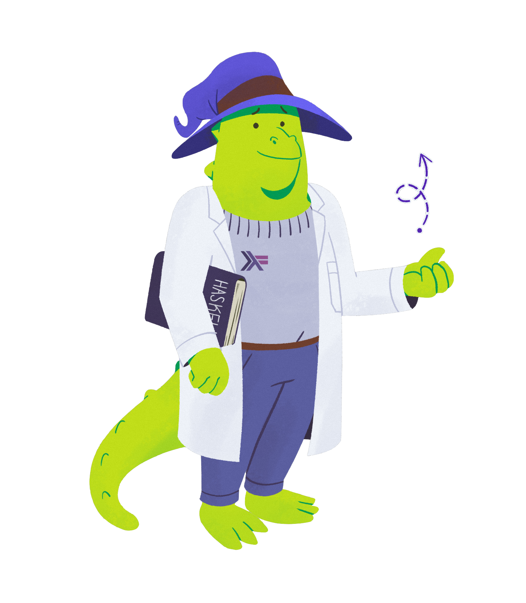

# Haskell Wizards

Our main [web service API at Fission](https://github.com/fission-suite/fission) is written in Haskell. Through a series of internal company jokes, we ended up coming up with the concept of Haskell wizards and lizards. Sometimes you feel like a wizard and can tackle anything, some times you feel more lizard-y and need to take some time to think and design before you're feeling confident again. 

We ended up adding the High Priestess as a third character who is a more femme expression of the concepts we were going for.

#### Licensing & Usage

You are welcome to use these illustrations. They are licensed under [Creative Commons By Attribution Share Alike \(CC BY-SA\) » ](https://creativecommons.org/licenses/by-sa/4.0/)

Please link to [fission.codes](https://fission.codes) for attribution. If you need the original source files for remixing, please get in touch.

Artwork created by [Bruno Monts](https://www.behance.net/brunomonts), a Brazillian illustrator.

### Haskell Wizard

The Haskell Wizard is part magic, part science. They're confident and proficient, using both tech tools and the magic of type theory, a scientist's lab coat, and a wizard hat, to tackle any software design challenge.

### Haskell Lizard

The Haskell Lizard is enjoying their Haskell journey, but sometimes feels a little confused. Is the compiler complaining AGAIN? Maybe it's just that another cup of coffee is needed, or an extra read through some Haskell books.

### Haskell High Priestess

The Haskell high priestess has got your back. She is stern but fair, wants you to get better, and is there to teach and support you.

The Haskell High Priestess currently graces the [Fission Support Page »](https://fission.codes/support)

